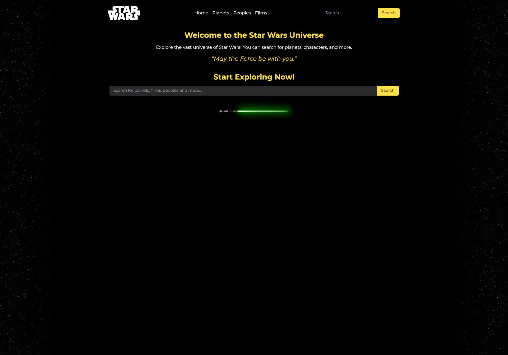
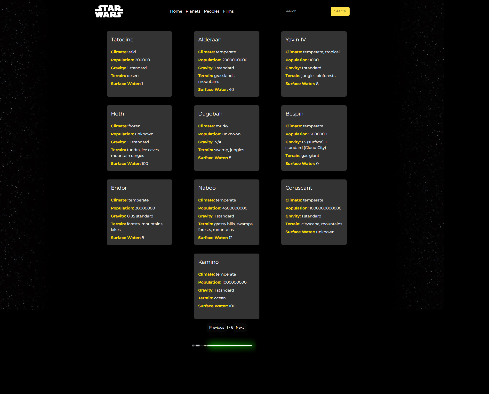
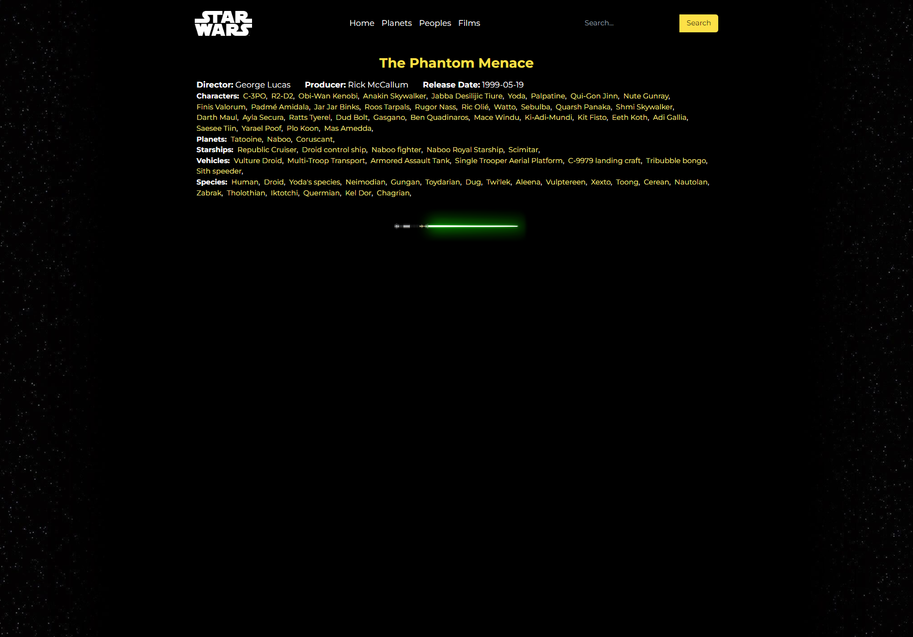

# Star Wars Universe Explorer 🌌

Проект "Star Wars Universe Explorer" представляет собой веб-приложение для исследования информации о планетах, персонажах и фильмах из вселенной Звездных войн.

## Инструкции по настройке

Перед началом установки убедитесь, что на вашем компьютере установлены следующие инструменты:

-   [Node.js](https://nodejs.org/) (версия 14 или выше)
-   [Git](https://git-scm.com/)

### Установка и запуск

1. Клонирование репозитория:

    ```bash
    git clone https://github.com/damirtag/starwarsexplorer.git
    ```

2. Перейдите в каталог проекта:

    ```bash
    cd starwarsexplorer
    ```

3. Установите зависимости:

    ```bash
    npm install
    ```

4. Запуск приложения:

    ```bash
    npm start
    ```

Приложение будет доступно по адресу `http://localhost:3000/`.

## Процесс проектирования и разработки

В процессе разработки использовались следующие технологии и инструменты:

-   React для создания пользовательского интерфейса.
-   React Router для навигации между страницами.
-   Axios для выполнения HTTP-запросов к API.
-   Tailwind для упрощения и ускорения стилизаций
-   SWAPI для данных

### Уникальные подходы и методологии

1. **Динамическая маршрутизация**: Используется динамическая маршрутизация для отображения детальной информации о планетах, персонажах и фильмах на основе их ID.

2. **Поиск по различным категориям**: Реализована возможность поиска планет, персонажей и фильмов через единый интерфейс.

3. **Кастомные хуки для API запросов**: Создан кастомный хук `_request` для упрощения и стандартизации API запросов.

4. **Мульти-поиск**: Мульти-поиск для быстрого нахождения данных по ключевым словам

### Компромиссы и известные проблемы

-   **Ограничение по количеству запросов**: Из-за ограничений API SWAPI, не все данные могут быть загружены за один раз, что может привести к нескольким запросам для полного отображения информации.

-   **Данные сужены**: Данные о звездных кораблях, транспорте и расе доступны только в катологе фильмов и к ним нет доступа через поиск.

## Скриншоты





## Заключение

Star Wars Universe Explorer предоставляет удобный интерфейс для изучения различных аспектов вселенной Звездных войн. Приложение было разработано с использованием современных технологий и подходов для обеспечения лучшего пользовательского опыта.
